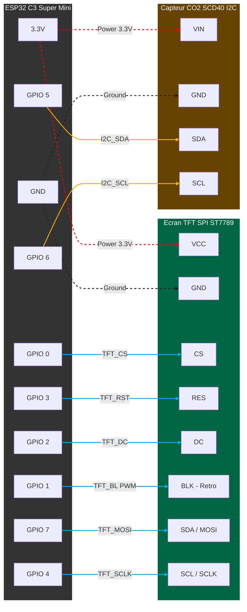

```mermaid
graph LR
    %% Definitions des composants
    subgraph ESP32["ESP32 C3 Super Mini"]
        direction TB
        V3["3.3V"]
        G["GND"]
        G0["GPIO 0"]
        G1["GPIO 1"]
        G2["GPIO 2"]
        G3["GPIO 3"]
        G4["GPIO 4"]
        G5["GPIO 5"]
        G6["GPIO 6"]
        G7["GPIO 7"]
    end

    subgraph TFT["Ecran TFT SPI ST7789"]
        direction TB
        TVCC["VCC"]
        TGND["GND"]
        TCS["CS"]
        TRES["RES"]
        TDC["DC"]
        TBLK["BLK - Retro"]
        TSDA["SDA / MOSI"]
        TSCL["SCL / SCLK"]
    end

    subgraph SCD["Capteur CO2 SCD40 I2C"]
        direction TB
        SVIN["VIN"]
        SGND["GND"]
        SSDA["SDA"]
        SSCL["SCL"]
    end

    %% Connexions Alimentation
    V3 -.->|"Power 3.3V"| TVCC
    V3 -.->|"Power 3.3V"| SVIN
    
    G -.->|"Ground"| TGND
    G -.->|"Ground"| SGND

    %% Connexions TFT SPI
    G0 ===>|"TFT_CS"| TCS
    G3 ===>|"TFT_RST"| TRES
    G2 ===>|"TFT_DC"| TDC
    G1 ===>|"TFT_BL PWM"| TBLK
    G7 ===>|"TFT_MOSI"| TSDA
    G4 ===>|"TFT_SCLK"| TSCL

    %% Connexions SCD40 I2C
    G5 --->|"I2C_SDA"| SSDA
    G6 --->|"I2C_SCL"| SSCL

    %% Styles
    classDef mcu fill:#333,stroke:#fff,stroke-width:2px,color:#fff
    classDef tft fill:#064,stroke:#fff,stroke-width:2px,color:#fff
    classDef sensor fill:#640,stroke:#fff,stroke-width:2px,color:#fff
    
    class ESP32 mcu
    class TFT tft
    class SCD sensor

    %% Style des liens (Alimentation vs Data)
    linkStyle 0,1 stroke:#f00,stroke-width:2px,stroke-dasharray: 5 5;
    linkStyle 2,3 stroke:#222,stroke-width:2px,stroke-dasharray: 5 5;
    linkStyle 4,5,6,7,8,9 stroke:#0af,stroke-width:2px;
    linkStyle 10,11 stroke:#fa0,stroke-width:2px;
```
